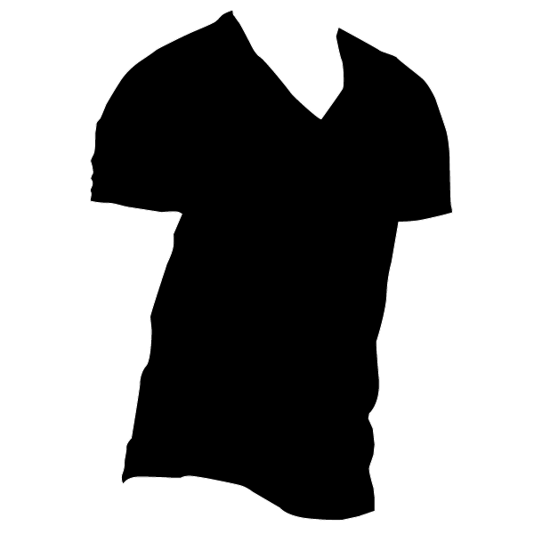

#The White T-shirt DataSet

This is a dataset of 245 segmented white t-shirt images. Pretty self explanatory! 

__Image__:

__Segmentation__:

We segmented it to test the [pix2pix](https://phillipi.github.io/pix2pix/) network

Structures like this:

* A (image)
	* test (5 images
	* train (216 images)
	* val (24 images)
* B (segmentation)
	* test (5 images
	* train (216 images)
	* val (24 images)

